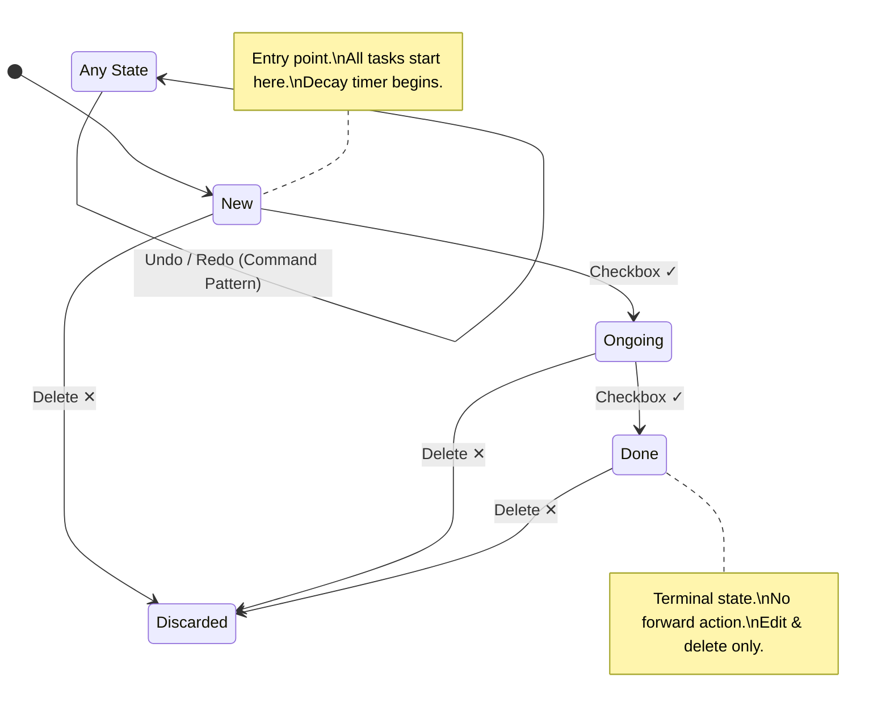
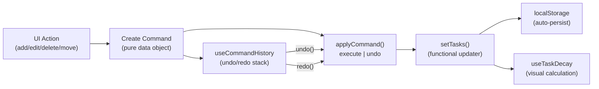

# ✔️ Ionic React TaskFlow

> **A Momentum-Driven Hybrid Mobile Task Management App**

### 📋 Executive Summary

**The Problem**

Traditional task management tools (Jira, Trello, Asana) often introduce **cognitive overload** for individual users and micro-teams. They optimize for features, not for action. Users waste time configuring boards and workflows instead of actually getting things done.

Worse, stale tasks accumulate silently. There's no visual feedback for items sitting untouched for days — they look exactly the same as fresh ones.

**The Solution**

TaskFlow implements two core differentiators:

1. **Unidirectional State Flow** — Tasks progress through a strict lifecycle (`New → Ongoing → Done`) rather than floating freely on a Kanban board. This reduces decision fatigue and enforces forward momentum.

2. **Task Decay** — A novel UX feature where tasks visually degrade over time when left untouched. This creates progressive psychological urgency without aggressive notifications, making stale work impossible to ignore.

### ✨ Key Features

**🔥 Task Decay (Unique Feature)**

Tasks are not static. They **age** over time based on `lastTouchedAt` timestamp:

| Decay Level | Idle Time | Visual Effect |
|:------------|:----------|:--------------|
| 🟢 **Fresh** | 0–24 hours | Normal appearance |
| ⏳ **Stale** | 1–3 days | Opacity 85%, yellow left border, badge `"⏳ 2d idle"` |
| ⚠️ **Decaying** | 3–5 days | Opacity 70%, desaturated, red border, badge `"⚠️ 4d idle"` |
| 💀 **Decayed** | 5+ days | Opacity 55%, heavily desaturated, red border, badge `"💀 7d idle"` |

Editing or moving a task **resets the decay timer**, rewarding interaction.

**↩️ Undo/Redo (Command Pattern)**

Every mutation (add, delete, edit, move) is encapsulated as a reversible **Command** object. This enables:

- Full undo/redo history (up to 50 actions)
- Accessible via toolbar buttons on every tab
- Commands are **pure data** (not closures), making them serializable and debuggable

**💾 Local Persistence**

All data is automatically persisted to `localStorage` with seamless migration support for schema changes.

**📱 Linear Flow Architecture**

Tasks progress through three phases with a single interaction (checkbox tap):

```
New (Red) ──checkbox──▶ Ongoing (Yellow) ──checkbox──▶ Done (Green)
```

The Done tab intentionally has no forward action — completed tasks stay completed, and can only be edited or deleted.

### 🏗 Architecture & Engineering Decisions

**State Transition Diagram**



**Component Architecture (Atomic Design)**

```
src/
├── context/
│   └── TaskContext.tsx          # Global state + Command Pattern interpreter
├── hooks/
│   ├── useCommandHistory.ts     # Generic undo/redo stack (reusable)
│   └── useTaskDecay.ts          # Decay level calculation utilities
├── components/
│   ├── TaskItem.tsx             # Task card with decay visuals
│   ├── TaskItem.css             # Decay CSS + card styles
│   └── UndoRedoButtons.tsx      # Reusable toolbar undo/redo controls
├── pages/
│   ├── Tab1.tsx                 # New Tasks (Red)
│   ├── Tab2.tsx                 # Ongoing Tasks (Yellow)
│   └── Tab3.tsx                 # Done Tasks (Green)
└── App.tsx                      # Router + Tab layout
```

| Layer | Role | Examples |
|:------|:-----|:--------|
| **Atoms** | Standard Ionic UI primitives | `IonButton`, `IonCheckbox`, `IonBadge` |
| **Molecules** | Encapsulated task UI with logic | `TaskItem`, `UndoRedoButtons` |
| **Organisms** | Page-level controllers with filtered state | `Tab1`, `Tab2`, `Tab3` |
| **Templates** | Routing and layout | `App.tsx` |

**Data Flow: Context API + Command Pattern**



_Why Command Pattern over simple state updates?_

- Every action is **reversible** — undo restores exact previous state, including timestamps
- Commands are **data, not closures** — avoids stale closure bugs, makes debugging trivial
- The pattern is a **recognized GoF design pattern** that demonstrates architectural thinking beyond CRUD

_Why Context API over Redux/Zustand?_

- Application scope is contained — a single domain (tasks) with 4 mutations
- Context + `useCallback` + functional updaters provide identical guarantees with zero additional dependencies
- Moving to a state library is straightforward if scope grows, since the Command Pattern abstraction is decoupled

### 🛠 Tech Stack

| Category | Technology | Decision Rationale |
|:---------|:-----------|:-------------------|
| **Framework** | Ionic 8 | Native-grade UI components via Shadow DOM, smooth platform-specific transitions |
| **View Engine** | React 18 | Concurrent features, robust hook ecosystem, industry standard |
| **Build Tool** | Vite 5 | Sub-300ms HMR, optimized production builds, ES module native |
| **Language** | TypeScript 5 | Compile-time type safety, discriminated unions for Command types |
| **Routing** | React Router v5 + history v4 | Pinned for `@ionic/react-router` compatibility |
| **Styling** | CSS3 Variables + Ionic Theming | CSS custom properties for responsive design and dark mode readiness |
| **Persistence** | localStorage | Zero-config, instant, with migration layer for schema evolution |

### 🐛 Bugs Identified & Resolved

During a comprehensive audit, **8 bugs** were identified and systematically resolved:

| # | Bug | Severity | Resolution |
|:--|:----|:---------|:-----------|
| 1 | **ID collision** — `Date.now()` produced duplicate IDs on rapid adds | 🔴 High | Replaced with `crypto.randomUUID()` |
| 2 | **Stale closures** — All state mutations referenced stale `tasks` variable | 🔴 High | Migrated to functional updaters `setTasks(prev => ...)` |
| 3 | **Dependency mismatch** — `history@5` incompatible with `react-router@5` | 🟡 Medium | Downgraded to `history@^4.10.1` |
| 4 | **Confusing cycle-back** — Done tab checkbox recycled tasks to New | 🟡 Medium | Removed checkbox from Done tab, made props optional |
| 5 | **Checkbox visual flash** — `IonCheckbox checked={false}` in Shadow DOM | 🟡 Medium | Checkbox conditionally rendered only where move is possible |
| 6 | **Unused import** — `useEffect` imported but never used | 🟢 Low | Now actively used for localStorage persistence |
| 7 | **Debug logs in production** — `console.log` statements left in code | 🟢 Low | Removed |
| 8 | **No data persistence** — All data lost on page refresh | 🟢 Low | Implemented localStorage with migration support |

### 💻 Installation & Development

**Prerequisites**

- Node.js v18+
- Bun (recommended) or npm

**Steps**

1. **Clone the Repository**

    ```bash
    git clone https://github.com/your-repo/ionic-react-taskflow.git
    cd ionic-react-taskflow
    ```

2. **Install Dependencies**

    ```bash
    bun install
    # or
    npm install
    ```

3. **Run Development Server**

    ```bash
    bun dev
    # or
    npm run dev
    ```

    Access the app at `http://localhost:5173`.

4. **Build for Production**

    ```bash
    bun run build
    ```

    Output will be generated in the `dist/` folder.

### 🎨 UI/UX Design Philosophy

**Floating Card Interface**

We moved away from the standard list view to a **Floating Card Interface** with intentional spatial design:

- **Subtle curves** — `border-radius: 0.75rem` for modern card feel without excessive rounding
- **Affordance** — Soft shadows (`box-shadow`) imply interactivity (sliding, tapping)
- **Breathing room** — Horizontal padding on lists and vertical spacing between cards prevent visual congestion
- **Color Semantics** — Red (urgency), Yellow (work-in-progress), Green (resolution)

**Progressive Decay Visualization**

The most distinctive UI element. Task cards are **living objects** that change appearance over time:

- CSS `filter: saturate()` and `opacity` transitions create smooth degradation
- Left-border color accent provides at-a-glance severity indicator
- `IonBadge` with emoji (`⏳ ⚠️ 💀`) gives precise idle-time context
- All transitions are animated (`transition: 0.5s ease`) for smooth visual updates

**Action Grouping**

All interactive controls (checkbox, edit, delete) are grouped on the right side (`slot="end"`) of each card, providing a consistent touch target zone.

### ☁️ Deployment

The application is configured for **Cloudflare Pages**:

- **Build Preset**: Vite / React Static
- **Output Directory**: `dist`
- **CI Pipeline**: Automatic deployments on push to `principal` branch

### 🗺 Roadmap

Potential future enhancements discussed in the architecture phase:

- [ ] **Energy-Based Filtering** — Filter tasks by mental effort level (Deep Focus / Autopilot / Creative)
- [ ] **Momentum Streak** — Gamification tracking consecutive days with completed tasks
- [ ] **Offline-First + Sync** — IndexedDB local storage with cloud sync and conflict resolution
- [ ] **State Machine** — Formal FSM (XState) for task lifecycle management
- [ ] **Comprehensive Testing** — Unit (Vitest), Integration (Testing Library), E2E (Cypress)
- [ ] **Keyboard Shortcuts** — Power-user navigation and action bindings
- [ ] **Dark Mode** — Full theme toggle leveraging existing CSS variable architecture
